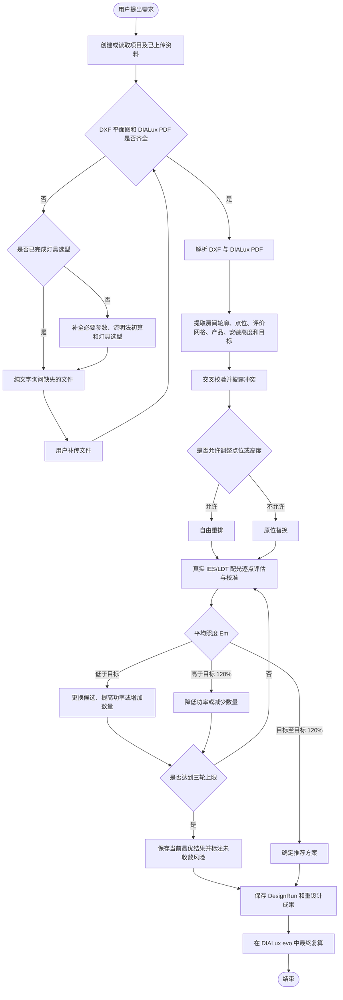

# 照明设计工作流

仅文字说明的新建项目先完成必要参数确认、初算和灯具选型；随后只用文字询问缺失文件，不生成上传问询表格或卡片。已上传两类文件的项目直接分析并进入存量重设计，无需先保存最终选型或生成 DIALux 任务包。

补传只询问尚缺文件，已完成的选型无需重复。普通 PDF 不替代 DIALux 设计报告；DWG 需补传 DXF；多份不同报告由用户文字确认采用哪份。存量 PDF 作为现状和校准依据，不代表新方案已经通过最终仿真。
