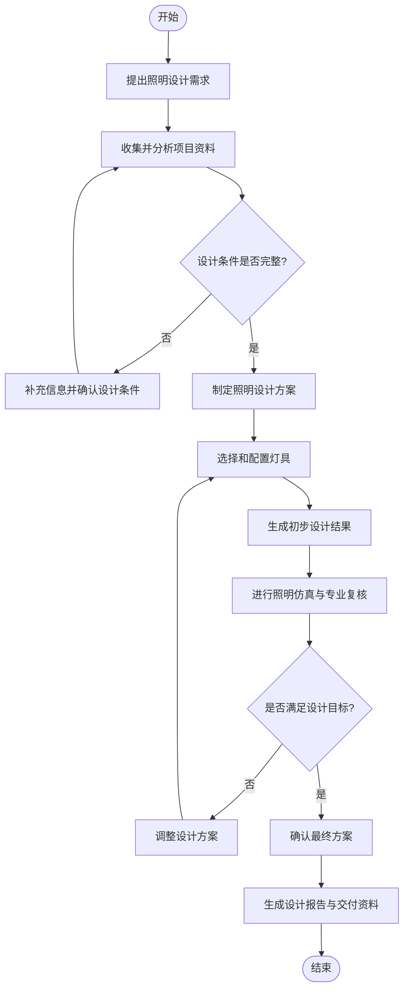

# 室内照明设计智能体工作流程

```mermaid
flowchart TD
    A([开始]) --> B[提出照明设计需求]
    B --> C[收集并分析项目资料]
    C --> D{设计条件是否完整?}
    D -- 否 --> E[补充信息并确认设计条件]
    E --> C
    D -- 是 --> F[制定照明设计方案]
    F --> G[选择和配置灯具]
    G --> H[生成初步设计结果]
    H --> I[进行照明仿真与专业复核]
    I --> J{是否满足设计目标?}
    J -- 否 --> K[调整设计方案]
    K --> G
    J -- 是 --> L[确认最终方案]
    L --> M[生成设计报告与交付资料]
    M --> N([结束])
```
