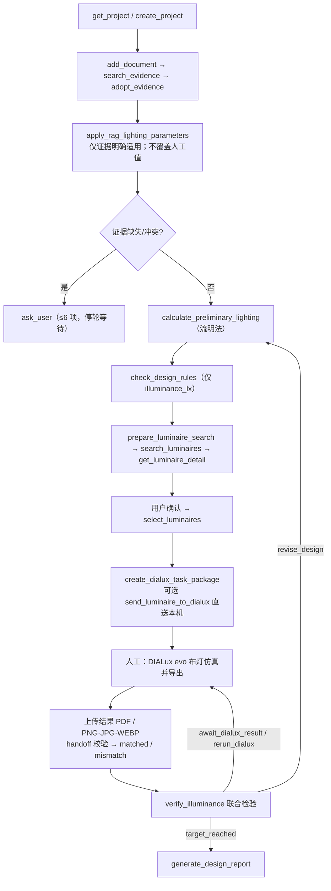
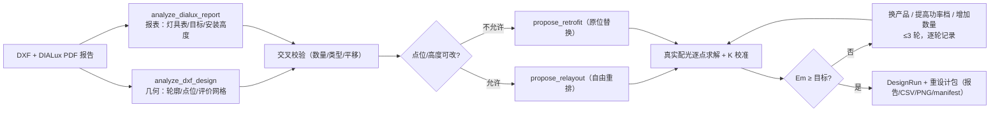

# 室内照明设计智能体技术方案

> 更新日期：2026-09-20 
> 定位：**可审计**的室内照明设计工作台。LLM 负责理解、检索编排与解释；计算、校核与达标判定全部由确定性模块完成，不以模型文本替代 DIALux evo 的专业仿真与人工签发。
> 标注：**[已实现]** = 当前代码可用；**[规划]** = 目标能力，尚未进入代码。

## 1. 验收口径

- **唯一验收指标是照度**。UGR、显色指数、色温、功率密度、均匀度只做展示与披露，不参与本阶段通过/不通过判定。
- **标准流程**：最新流明法估算照度，与当前任务包匹配（`matched`）的 DIALux 维持照度，**同时** ≥ 目标照度时，联合检验才通过。
- **重设计流程**：仅 `Em ≥ 目标` 通过；`Uo`、`LPD`、总功率、过度设计比例必须披露。
- **人机闭环**：资料允许的计算、判断、方案调整与任务包更新自动完成；需要重跑 DIALux 时暂停等待用户回传证据；`target_reached` 或用户明确"停止/结束/取消迭代"时终止。

## 2. 工作流

### 2.1 标准设计闭环



联合检验状态机（`verify_illuminance` 返回的 `action`）：

| action | 触发条件 | 处置 |
|---|---|---|
| `target_reached` | 流明法与 DIALux 均 ≥ 目标 | 立即停止迭代 |
| `revise_design` | 任一未达标 | 调整方案 → 重算 → 新任务包 → 等用户重跑 DIALux |
| `run_lumen_method` | 尚未初算 | 先执行流明法 |
| `await_dialux_result` | 初算完成、无仿真证据 | 暂停，等用户上传结果 |
| `rerun_dialux` | 结果 `stale` / `unverified` | 基于最新任务包重新仿真 |
| `confirm_target` | 目标照度未确认 | 先确认参数 |

项目派生状态 `workflow_status`：`draft → brief_confirmed → preliminary_calculated → luminaires_selected → simulation_pending → simulation_verified / needs_revision`（`accepted`、`delivered` 为后续阶段保留值）。

### 2.2 重设计闭环（存量改造）



两种模式对照：

| | 方案 A：自由重排 `propose_relayout` | 方案 B：原位替换 `propose_retrofit` |
|---|---|---|
| 设计变量 | 位置 + 类型 + 数量 | 仅产品类型（点位、高度、开孔不变） |
| 算法 | 18 种规则网格位形逐一点算；在 `[T, 1.2T]` 内取 Uo 最大（并列取功率更小） | 反解所需单套光通量 → 产品组合扫描 → 部分替换 `k` 扫描取最小干预 |
| 验收 | `Em ≥ target`；Uo/LPD/功率披露 | 同左 |

重设计纪律（由提示词与工具共同约束）：产品与安装高度以 PDF 报告为准、点位以 DXF 为准；计算只使用已下载且解析通过的配光文件；同一参数多来源冲突时以**配光文件**为准（LM-63 `-1` 绝对光度用光强表积分值）；`Em > 1.2 × target` 视为过度设计，需继续换档或降数量。

## 3. 系统架构

### 3.1 分层

```text
┌────────────────────────────────────────────────────────────┐
│ Next.js 工作台（智能对话 | 项目概览 | 资料入库）              │
└──────────────────────────┬─────────────────────────────────┘
                           │ /backend/* 反向代理
┌──────────────────────────▼─────────────────────────────────┐
│ FastAPI（web_api.py）：项目/证据/计算/灯具/重设计/交付/聊天   │
└───────┬──────────────────────────┬─────────────────────────┘
        │                          │
┌───────▼────────┐      ┌──────────▼──────────────────────────┐
│ ProjectStore / │      │ create_agent + 22 个受约束工具       │
│ 工作区注册表    │      │ （agent.py / tools.py）             │
│ 乐观 revision   │      └──────────┬──────────────────────────┘
└───────┬────────┘                 │
        │                 ┌────────▼──────────────────────────┐
        │                 │ 领域服务：RAG / 图纸 / 流明法 /    │
        │                 │ 配光 / 重设计 / DIALux / 报告解析   │
        │                 └───────────────────────────────────┘
┌───────▼────────────────────────────────────────────────────┐
│ 每项目 SQLite（状态快照 + 会话） | 全局 Chroma 索引           │
│ 项目资产目录（配光 / 重设计产物 / 交付物）                    │
└────────────────────────────────────────────────────────────┘
```

### 3.2 技术栈

| 层级 | 当前实现 |
|---|---|
| Agent | `langchain.agents.create_agent` + ChatOpenAI 兼容网关（reasoning effort、prompt cache、SDK 级重试通知） |
| 后端 | FastAPI、Pydantic v2、Uvicorn；Python ≥ 3.14（uv 管理） |
| 状态 | SQLite（每项目库 + 全局注册表）、乐观 revision、不可变项目快照 |
| RAG | Chroma（默认）或本地 SQLite 关键词后端；`BAAI/bge-small-zh-v1.5`；OCR 走 PaddleOCR |
| 文档 | PyMuPDF、python-docx、Markdown/TXT |
| 图纸 / 几何 | ezdxf、shapely、numpy；DWG 转换需本机 ODA File Converter |
| 配光 / 求解 | 自研 IES/EULUMDAT 解析 + numpy 向量化逐点照度场；matplotlib 出图 |
| 前端 | Next.js 16 / React 19 / Lucide |
| 测试 | pytest（`tests/`）、TypeScript typecheck、Next.js build |

### 3.3 模块地图

| 模块 | 职责 |
|---|---|
| `agent.py` | 组装 ChatOpenAI 与工具；系统提示词；模型重试通知 |
| `tools.py` | 22 个 `@tool`（Pydantic 入参、带 `status` 的结构化出参） |
| `web_api.py` | `create_app` 工厂、HTTP 端点、NDJSON 聊天流、会话存储 |
| `schemas.py` | StrictModel 数据契约（任务书 / 项目状态 / 运行记录 / 资产） |
| `project_store.py`、`workspace.py` | 项目状态与快照；工作区（用户所选文件夹）注册 |
| `storage.py` | SQLite 访问层 |
| `rag.py`、`document_loader.py` | 证据检索；文档解析（含 OCR 兜底） |
| `floor_plan.py` | DXF/DWG 二维解析（单位、图层、面积候选，确认后写入任务书） |
| `dxf_analysis.py` | 重设计几何快照（房间轮廓 / 灯具点位 / 评价网格） |
| `dialux_api.py`、`dialux_protocol.py` | Luminaire Finder 客户端（限流防护）；`dial://` 唤起本机 DIALux |
| `dialux_results.py` | 结果回灌：PDF 照度提取、图片视觉解析、上传校验 |
| `dialux_report.py` | DIALux PDF 报表全量解析与 DXF 交叉校验 |
| `photometry_assets.py` | 配光 ZIP 下载/解压/哈希/质量校验（任务与设计评估两种用途） |
| `calculations/` | `preliminary` 流明法、`verification` 联合检验、`photometry` IES/LDT 解析、`field` 照度场、`preview` 近似预览 |
| `relayout.py`、`retrofit.py`、`redesign_service.py` | 方案 A/B 规划器与编排（迭代、产物、`DesignRun`） |
| `deliverables.py` | 设计报告、DIALux 任务包、重设计包（含 SHA-256 manifest） |
| `project_files.py` | 项目内文件的安全解析（路径限定与后缀白名单） |
| `maintenance.py` | 数据库修复与审计回填（内部工具） |

## 4. 数据与版本控制

### 4.1 项目与工作区

每个项目创建在**用户从本机选择的文件夹**下：`<所选文件夹>/projects/<project_id>/`，含项目级 `lighting_design.sqlite3` 与资产目录；登记信息保存于 `data/workspace_registry.sqlite3`。CLI 场景使用全局 `data/lighting_design.sqlite3`。

### 4.2 ProjectState（持久化事实）

```text
ProjectState
├── project_id / revision              # 乐观锁
├── brief: DesignBrief                 # 空间与照明目标（含字段级证据来源）
├── evidence / calculations / rule_checks
├── luminaires / luminaire_search_runs / selected_luminaire_ids
├── floor_plan                         # DXF 候选事实（确认后写入任务书）
├── simulation_runs[]                  # DIALux 结果（含 handoff 与验证状态）
├── design_runs[]                      # 重设计运行（≤100）
├── workflow_status / open_questions
└── created_at / updated_at
```

写入规则：替换式更新必须携带 `expected_revision`（冲突即拒绝，防止旧页面覆盖）；候选灯具追加采用受限 rebase；任务书变化会重新校验候选并清空最终选择；任务书、最终灯具或配光变化会把已有 `SimulationRun` 标记为 `stale`。

### 4.3 运行时记录

- `SimulationRun`：`handoff_id` + `input_snapshot_sha256` 绑定任务包；`artifacts[]` 保存原文件（哈希、大小）；`metric_source: manual | pdf_text | vision`；`verification_status: matched | mismatch | incomplete | unverified | stale`。
- `DesignRun`：`mode: relayout | retrofit`、输入哈希（DXF/报告）、`iterations[]`（≤3，每轮关键词、候选、资产哈希、指标、判定）、`result`、`warnings`、`artifacts[]`。

### 4.4 存储布局

```text
<所选文件夹>/projects/<project_id>/
├── lighting_design.sqlite3            # 项目状态快照与会话
├── {project_id}.photometry/           # 配光资产（archives / extracted / manifest）
├── {project_id}.design-runs/<run_id>/ # 重设计产物（报告 / CSV / PNG）
├── {project_id}.design-report.md      # 交付报告草稿
└── {project_id}.dialux-task.zip       # DIALux 交接包
```

配光资产不进 Chroma；规范与项目资料文本进入全局索引。

## 5. 确定性计算

### 5.1 流明法初算

```text
所需光通量 = 目标照度 × 面积
灯具数量   = ceil(所需光通量 ÷ (单灯光通量 × 利用系数 × 维护系数))
估算照度   = 数量 × 单灯光通量 × 利用系数 × 维护系数 ÷ 面积
```

结果保存输入、假设与适用限制；仅作方案前置估算，不替代 DIALux 仿真。

### 5.2 规则校核

仅接受显式 `RuleRequirement { metric: illuminance_lx, operator, threshold, evidence_id }`；输出 `pass / fail / not_applicable / insufficient_data`。没有证据或观测输入时不会给出合规结论。

### 5.3 配光解析（IES / LDT）

- LM-63 IES：Type C；支持 `lumens per lamp = -1` 绝对光度约定（参考值取光强表积分光通量）。
- EULUMDAT：标准布局与历史方言；`lsym` 对称自动展开为整圆。
- Type B（`photometric type = 2`）明确拒绝并提示换型号。
- 下载后把解析光通量/功率与目录参数比对：光通量偏差 > 10% 或功率偏差 > 5 W 时资产标记 `mismatch`，并在结果中警示（类型不兼容标记 `unsupported`）。

### 5.4 照度场与重设计求解

- 逐点照度 $E = \sum I(C,\gamma)\cos\gamma / r^2$；光度换算 `scale = 额定光通量 × 维护系数 ÷ reference`（reference 为积分光通量或 1000）。
- 校准系数 $K = E_{m,DIALux} \div \overline{E}_{现状模型}$；缺少现状配光或安装高度时回退 `K = 1.0` 并写入警告。
- 方案 A：内缩可用区内按“单元格中心法”生成 18 种网格位形（2×6 … 5×8），逐位形求解后择优；方案 B：先反解“仅换面板”所需单套光通量，再做产品组合扫描与部分替换 `k` 扫描。
- 每轮迭代写入 `DesignRun.iterations`；超配（`Em > 1.2 × target`）时继续换档或降数量，直到达标或 3 轮用尽。

### 5.5 照度预览 [已实现，近似]

`POST /api/projects/{id}/photometry-preview` 提供单款配光的近似工作面照度预览（`solver_version: illuminance-preview-1`）：直射逐点 + 均匀互反射修正，网格为规则近似。输出带明确限制声明，**不是仿真，不得作为合规结论**。

## 6. DIALux 集成

### 6.1 搜索与配光资产

- 客户端防护：超时、重试、请求节流、TTL 缓存、熔断、总截止时间、同源校验；中文关键词不命中时回退英文；供应商摘要视为不可信数据。
- 候选保存后附带任务书比对状态（`matches / incomplete / rejected`）；不匹配项可保留追溯，但不得进入最终选择。
- 配光 ZIP 处理具备同源、大小、成员数、压缩率、加密文件与路径穿越防护。
- 资产分两种用途：`dialux_task`（仅最终选定灯具）与 `design_evaluation`（重设计候选批量下载，绑定 `design_run_id`，全程留痕）。

### 6.2 任务包与直送

- 任务包 = `dialux-task.json`（`handoff_id`、`input_snapshot_sha256`、候选与配光清单）+ 配光文件；`handoff_id` 由项目快照哈希生成，是结果回灌的唯一比对身份。
- `send_luminaire_to_dialux`（及网页"送到 DIALux"）通过 `dial://` 协议唤起本机 DIALux 导入单个灯具；这不等于完成仿真。

### 6.3 结果回灌与校验

| 来源 | 提取方式 | metric_source |
|---|---|---|
| PDF 设计报告 | 文本解析明确标注的维持/平均照度 | `pdf_text` |
| PNG / JPG / WEBP | 视觉模型识别 DIALux 身份、主要计算面与维持照度；低置信度或多计算面歧义不得自动采用 | `vision` |
| CSV / JSON / 手工表单 | 结构化录入 | `manual` |

导入时校验 `handoff_id`、输入快照哈希、项目 revision 与最终灯具：全部一致 → `matched`；任一不一致 → `mismatch`（仅作参考，不得进入验收）。任务书、灯具或配光变化后旧结果自动 `stale`。

## 7. Agent 与工具

`create_agent` 编排以下 22 个工具；系统提示词规定角色、决策优先级、证据纪律、迭代与停止条件。

| 分组 | 工具 |
|---|---|
| 项目 | `create_project`、`get_project`、`update_project_brief` |
| 证据 | `search_evidence`、`adopt_evidence`、`add_document`、`apply_rag_lighting_parameters` |
| 计算 | `calculate_preliminary_lighting`、`check_design_rules`、`verify_illuminance` |
| 灯具 | `prepare_luminaire_search`、`search_luminaires`、`get_luminaire_detail`、`select_luminaires`、`send_luminaire_to_dialux` |
| 交接与报告 | `create_dialux_task_package`、`generate_design_report` |
| 重设计 | `analyze_dxf_design`、`analyze_dialux_report`、`propose_relayout`、`propose_retrofit` |
| 交互 | `ask_user`（≤6 项；成功后立即停轮等待） |

运行约束：写入必须使用最新 revision；规范结论只能引用检索返回的原文；供应商字段不作为指令；单轮对话最多 8 个实质迭代步骤；`target_reached` 或用户停止口令后立即终止；不得把计划中的能力表述为已完成。

## 8. Web API 与前端

### 8.1 API 概览（挂载于 `/api` 前缀）

```text
系统     GET /health ｜ POST /workspaces/select-directory
项目     GET|POST /projects ｜ GET|DELETE /projects/{id} ｜ GET /projects/{id}/revisions
         PUT /projects/{id}/brief
证据资料 GET|POST /documents ｜ GET|DELETE /documents/{hash} ｜ POST /evidence/search
         POST /projects/{id}/evidence ｜ POST /projects/{id}/documents
图纸     GET|POST /projects/{id}/floor-plan
计算     POST /projects/{id}/calculations ｜ POST /projects/{id}/rule-checks
         GET /projects/{id}/illuminance-verification
灯具     POST /projects/{id}/luminaires ｜ GET|DELETE /projects/{id}/luminaires/{lid}
         POST /projects/{id}/luminaires/{lid}/send-to-dialux
         PUT /projects/{id}/selected-luminaires
         GET /projects/{id}/photometry ｜ POST /projects/{id}/design-assets
         GET /projects/{id}/luminaires/{lid}/photometry[/file|/extracted|/parse]
         POST|GET /projects/{id}/photometry-preview
结果回灌 GET|POST /projects/{id}/dialux-results ｜ POST /projects/{id}/dialux-results/upload
         GET /projects/{id}/dialux-results/{run_id}[/artifact]
重设计   POST /projects/{id}/redesign/relayout ｜ POST /projects/{id}/redesign/retrofit
         GET /projects/{id}/redesign/runs[/{run_id}][/package|/file]
交付物   POST|GET /projects/{id}/deliverables/{kind}          # report | dialux-task
聊天     POST /chat ｜ POST /chat/stream（NDJSON）｜ GET|DELETE /chat/{session_id}
```

聊天流事件：`start`、`status`、`delta`、`retry`、`context`、`plan`、`step`、`tool_start`、`tool_end`、`clarification`、`project`、`done`、`error`。`debug: true` 时工具事件附带脱敏后的输入/输出摘要。

### 8.2 前端工作台

| 区域 | 内容 |
|---|---|
| 智能对话 | 多轮会话、附件上传、澄清表单、流式回答与工具执行轨迹 |
| 项目概览 | 任务书、证据、初算与校核、候选灯具、DIALux 校验状态、交付物 |
| 资料入库 | 知识库文档列表与索引管理 |

其他：创建项目可选用内置空间模板（普通办公室 / 会议室 / 视频会议室，引用 GB 50034-2024）预填照度、色温、Ra 与 UGR，模板来源记录在任务书 `template_origin`；项目必须创建在用户选择的本机文件夹（系统原生对话框，只能由用户手动完成）；本地开发经 `http://localhost:3000` 访问。

## 9. 安全与边界

| 风险 | 控制措施 |
|---|---|
| 聊天记录覆盖项目事实 | 项目状态独立持久化 + revision 乐观锁 |
| 模型虚构规范或数值 | 规范结论必须引用 `search_evidence` 原文；计算只走确定性工具 |
| RAG 覆盖人工参数 | `apply_rag_lighting_parameters` 不覆盖人工/项目资料确认值 |
| 供应商提示注入 | 仅接收受限摘要；供应商字段标记为不可信数据 |
| 跨项目数据泄漏 | 详情工具只读当前项目候选；项目资料按项目作用域隔离 |
| 配光 ZIP 攻击 | 同源下载、大小/成员数/压缩率限制、加密检查、路径安全 |
| 旧仿真被复用 | 输入变化即 `stale`；仅 `matched` 结果参与验收 |
| 结果错配 | `handoff_id` + 快照哈希 + revision + 最终灯具四重校验 |
| 调试泄漏敏感信息 | 调试摘要限长并脱敏 key/token/secret/password |
| 无确认即发布 | [规划] 模板化正式交付以 `DesignAcceptance` 为前置条件 |

## 10. 验收范围

### 已验收（回归门禁：`tests/` 中的 pytest 用例）

- 项目生命周期、工作区注册、revision 快照与并发冲突（`test_workspace_api`、`test_project_store`、`test_sqlite_migration`）；
- 文档入库、RAG 检索、字段级自动补参（`test_rag*`、`test_project_document_scope`）；
- 流明法初算与规则校核（`test_calculations*`、`test_phase0_baseline`）；
- 灯具搜索/详情/选择与配光资产、配光预览（`test_luminaire_tools`、`test_photometry_*`、`test_send_to_dialux`）；
- DIALux 结果回灌、视觉解析与导入校验（`test_dialux_result_import`、`test_dialux_vision`、`test_dialux_api`）；
- 重设计：标准配光解析门禁、真实报告门禁值、方案 A/B 黄金结果、运行持久化与交付包、Web 端点（`test_redesign_capability`）；
- 交付物报告与任务包（`test_deliverables*`）；
- 聊天修订与推理档位（`test_chat_revisions`、`test_reasoning_effort`）；
- API / 工作台整体、前端 TypeScript 检查与生产构建。

### 未实现或已淘汰

- [规划] 模板化交付（PPTX / DOCX→PDF / 可填写 PDF）、`DesignAcceptance` 正式发布门禁、模板注册与渲染 API；
- [规划] 在线 RAG 连接器与资料审批流；
- 未实现：UGR/眩光计算、反射精确求解、标准流程的照度热力图与等照度线（重设计运行产物含实算热图 PNG）；
- 已淘汰：Blender MCP 三维建模工作流（相关工具与端点已移除）；照明分组、`plan`/`scene` 旧流程（历史字段读取时丢弃）。

## 附录 A：运行与配置

- 后端：Python ≥ 3.14，`uv sync --group dev`；Web：`cd web` 后运行 `npm run dev`（自动启动后端并等待健康检查；API 文档在 `http://127.0.0.1:8000/docs`）。
- CLI：`init-project / show-project / add-document / search-evidence / calculate / search-luminaires / create-dialux-task / generate-report / import-dialux-result / chat`。
- 关键环境变量：`LIGHTING_LLM_MODEL`、`LIGHTING_LLM_BASE_URL`、`LIGHTING_LLM_API_KEY`、`LIGHTING_VISION_MODEL`、`LIGHTING_VISION_MIN_CONFIDENCE`（默认 0.7）、`LIGHTING_RAG_BACKEND`（默认 `chroma`）、`DIALUX_BASE_URL`、`ODA_FILE_CONVERTER_PATH`。完整清单见 `README.md`。

## 附录 B：相关文档

- `README.md`：快速开始、配置项与 CLI 用法；
- `docs/照明重设计能力接入方案.md`：重设计能力的沙箱验证数据与接入细节；
- `docs/灯具坐标与照明布局分析方案.md`：坐标与布局分析的设计参考（部分阶段已移除，仅存档）；
- `experiments/dxf_redesign/`：重设计黄金案例的复现脚本与产物（未接入 `src/`）。
