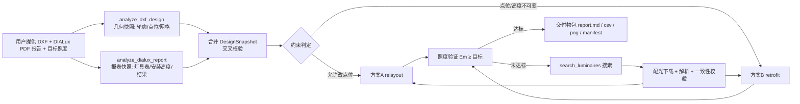

# 照明设计智能体 · 重设计能力接入方案（执行版）

> 版本 v1.3 · 2026-09-19 · 依据 `experiments/dxf_redesign/` 全部实测结果编写
> **v1.1 更新**：输入统一为「**DXF + DIALux PDF 报告**」——PDF 报告提供灯具表（型号/光通量/功率/数量/维护系数）与**灯具安装高度**、结果指标，替代此前的口述/假设参数。
> **v1.2 更新**：已拿到真实报告（`512会议室_说明_报告.pdf`，17 页）并在沙箱完成解析验证：工作面 **0.750 m**、安装高度 **3.405–4.173 m**、目标 **750 lx / Uo≥0.60 / RUG≤19**、灯具表（20+16 款）与**逐灯坐标**全部提取成功；报告坐标与 DXF 坐标经平移匹配（Δ≈+0.717, −0.200 m，σ≤0.0005）确认为**同一布局**。
> **v1.3 更新（决策落实）**：① 参数冲突**以配光文件为准**（现状筒灯 750 lm；全部灯具光通量统一取文件声明/积分值）——沙箱已按此口径重算（K=1.2643）；② **本轮验收仅 Em ≥ 750 lx，暂不含均匀度**（Uo≥0.60 仅披露）。黄金案例数值已刷新：方案 A 推荐 **P24_3x8（877.9 lx）**、方案 B 推荐 **AERMLED+CDN40（816.1 lx；最小 k=12 → 761.8 lx）**。
> 用途：按本方案把「**DXF+PDF 现状解析 → 灯具搜索/配光下载 → 重设计（方案 A / 方案 B）→ 照度验证（≥ 目标）→ 迭代 → 交付物**」接入智能体。
> 所有参考数值均由真实配光逐点求解得到，沙箱复现命令见 §9.1。

---

## 0. 两条能力线（本次已产出的两个设计方案）

| | **方案 A：自由重排** | **方案 B：原位替换** |
|---|---|---|
| 设计变量 | 灯具**位置 + 类型 + 数量** | 仅**产品类型**（位置、高度、开孔均不变） |
| 适用场景 | 装修同步进行 / 允许改吊顶点位 | 既有装修翻新 / 点位与吊顶标高受限 |
| 核心算法 | 可用区均匀网格候选（18 种位形）→ 逐位形评估 → 目标窗口择优 | 固定点位 → 反解所需光通量 → 产品组合扫描 → 部分替换 k 扫描 |
| 参考结果 | P21_3x7 = 21×Opple J6012 70W，**Em 795.4 lx ✅**，Uo 0.39，LPD 9.88 | 保留 20 面板 + 12~16×CDN 6311 40W 筒灯，**Em 763~818 lx ✅**，Uo 0.15，LPD 7.3~8.2 |

统一闭环：



**迭代规则（用户硬性要求，需写入服务逻辑）**：先搜索灯具 → 设计 → 验证平均照度是否 ≥ 目标（本案例 750 lx）；**未达标则重新搜索、重新下载配光、重新设计**（上限 3 轮，逐轮放宽口径：功率档位 / 品类 / 数量位形，并记录每轮证据）。

---

## 1. 验收基准（先固化这两个"黄金案例"）

### 1.1 方案 A 基准（自由重排 @ 512会议室）

**输入**：`教室立体图2.dxf`（DIALux evo 5.14 导出）+ **DIALux PDF 设计报告**（已解析验证）；面积 148.7 m²（报告 149.0 m²）；评价网格 196 点（DXF 重建）；现状 20 面板 + 16 筒灯（报告 Em=599 lx）；**目标 Em ≥ 750 lx（报告目标值）**；面板安装高 3.405 m、筒灯 4.173 m（**PDF 报告提取**）、工作面 0.750 m（报告值）、离墙退让 0.6 m；设计灯具 = Opple J6012（**配光文件积分 7510.6 lm**，70 W，MF 0.8）；校准系数 **K=1.2643**。

**结果**（按"配光文件为准"口径重算，2026-09-19）：

| 指标 | 现状 | 推荐 P24_3x8 | 备选 P21_3x7 |
|---|---|---|---|
| 灯具 | 20×AERMLED3 30W + 16×ERD 6.2W | **24×J6012 70W**（3 列 × 8 行，列距 2.56 m × 行距 2.11 m） | 21×J6012（3×7，行距 2.41 m） |
| Em | 599 lx | **877.9 lx ≥ 750 ✅** | 769.4 lx ≥ 750 ✅ |
| Uo / Ud | 0.099 / 0.034 | 0.389 / 0.288 | 0.387 / 0.285 |
| 总功率 / LPD | 699 W / 4.69 W·m⁻² | 1680 W / 11.30 W·m⁻² | 1470 W / 9.88 W·m⁻² |

> 选型规则：Em ∈ [750, 900] 内取 Uo 最大者——P24_3x8（0.389）以微弱优势胜 P21_3x7（0.387）；若按"最省电"偏好可选 P21_3x7（少 3 套、省 210 W）。

**产物**（`experiments/dxf_redesign/out/`）：`design.json`、`candidates.csv`（18 位形）、`recommended_layout.csv`（逐点坐标）、`layout_compare.png`、`heatmap_compare.png`、`redesign_report.md`。

### 1.2 方案 B 基准（原位替换 @ 同一房间）

**输入**：同上 DXF + DIALux PDF 报告；**约束：位置与高度不变**（高度以 PDF 报告提取值为准）；候选产品 5 面板 × 4 筒灯（见 `finder/design_products.json`）；目标 Em ≥ 750 lx。

**核心反解**：若保留筒灯、仅整体换 20 套面板 → 单套额定光通量需 ≥ **5637 lm**（现行 4379.2 lm（配光文件）；标准 600×600 嵌入式目录品最高 ≈4205 lm，不够）→ 说明本约束下"换筒灯"是更有效的干预点。

**结果（20 组组合扫描 + k 扫描；按"配光文件为准"口径重算，2026-09-19）**：

| 方案 | Em | Uo | 总功率 | 说明 |
|---|---|---|---|---|
| **推荐：保留 20 面板 + 等距换 12/16 筒灯为 CDN 6311 40W**（Ø160 同开孔） | **761.8 lx ✅**（k=12）/ **816.1 lx ✅**（k=16，+8.8%） | 0.051→建议 k≥13（Uo 回升至 ≈0.15） | 1092 / 1223 W（LPD 7.34 / 8.22） | 最小替换量；k=12 的 Uo 异常低（分布不均），建议取 k≥13 |
| 只换 20 套面板为 J6012 70W（600×1200 跨格） | 888.9 lx | 0.048 | 1499 W / LPD 10.08 | 均匀度仍差、需吊顶改造 |
| 双侧全换（面板+筒灯） | 1106.0~1800.3 lx | 0.10~0.21 | 2023~3095 W | 明显过度，不推荐 |

**产物**（`experiments/dxf_redesign/out_keep/`）：`scenarios.csv`（20 组）、`mixed_sweep.csv`（k=0..16）、`fixed_positions_check.json`、`heatmap_keep.png`、`report_keep.md`。

### 1.3 共同口径（必须保持一致，否则结果不可比）

- **输入分工**：DXF = 几何（房间轮廓、灯具点位、评价网格）；**PDF 报告 = 产品与标高**（灯具表、安装高度、计算结果）；两者交叉校验（按类型的数量/型号/光通量核对），冲突时"产品与高度取 PDF、点位取 DXF"，并写入警告；
- **安装高度/工作面**：**已由真实报告验证可直接提取**——安装高度 3.405/4.173 m、工作面 0.750 m、边缘区 0.093 m（此前 "0.75 m 假设"得到确认）；缺报告时才回退显式参数 + 警告；
- **设计目标从报告自动读取**：本案例目标 Em ≥ 750 lx、**Uo(g1) ≥ 0.60**、RUG ≤ 19（应用场所：办公室 · 34.5.1 视频会议室）；目标值优先于用户口述，用户显式要求可覆盖；
- **验收范围（用户决策 2026-09-19）**：**本轮仅验收 Em ≥ 750 lx**；Uo（报告目标 0.60）与 RUG 暂不作为验收条件，但方案输出必须继续披露（当前 A 0.389 / B 0.145）；后续如需启用，切换"均匀度优先"模式（选型改为最大化 Uo）；
- **参数冲突口径（用户决策 2026-09-19）**：同一参数多来源冲突时，以**配光文件为准**——声明值优先，`-1` 绝对光度文件用表格积分值；报告/清单/目录值仅作参考与差异记录（现状筒灯 750 lm；面板 4379.2 lm；J6012 7510.6 lm）；
- **逐灯坐标交叉校验**：报告含全部 36 套灯具的 X/Y/Z（面板 3.405 m、筒灯 4.173 m）与编号；与 DXF 点位仅为平移关系（Δx=+0.717 m、Δy=−0.200 m），可用于几何一致性校验，亦可作为无 DXF 时的点位备选来源；
- 光通量换算：`scale = 灯具额定光通量 × 维护系数 ÷ reference`；`reference = 表格积分光通量（绝对光度文件）或 1000（cd/1000lm 相对光度文件）`；
- 照度求和：`E = Σ I(C,γ)·cosγ / r²`（逐灯逐点，复用 `calculations/preview.py::_IntensityInterpolator` 的 C/γ 双线性插值）；
- 室内增益：单一校准系数 `K = DIALux 报告均值 ÷ 模型原始均值`（本案例 **K=1.2643**，由现状设计标定，配光文件口径）；
- 评价点：DXF 重建的 DIALux 评价网格（**用"单元格中心法"布点**，不可直接用轮廓 buffer 边界坐标，会因边界判外被裁光）。

---

## 2. 现状盘点与差距

| 组件 | 智能体现状 | 差距 / 要做的 |
|---|---|---|
| DIALux 搜索 | ✅ `DialuxAPI` + `prepare/search/get_detail/select` 工具 + 网页端点 | 无（直接复用）；注意搜索排序与关键词模糊问题需在设计服务中多关键词兜底 |
| 配光下载 | ✅ `download_photometry_zip`（同源校验/50MB 上限）；`PhotometryAssetStore`（ZIP/解压/哈希） | ⚠️ 仅允许**最终选定**灯具下载 → 设计评估需要**候选批量下载**（§3.8 权限调整） |
| IES 解析 | ✅ 支持 LM-63（正光通量、Type C） | ❌ 不支持 `lumens per lamp = -1`（绝对光度约定，实测 J6012/CDN 系列均如此）；❌ Type B（type=2）无明确提示 |
| **LDT 解析** | ⚠️ 仅支持自定义方言（测试夹具格式） | ❌ **读不了标准 EULUMDAT**（DIAL 导出文件直接解析失败）——**阻断项** |
| 照度预览求解 | ✅ `calculations/preview.py`（插值器 + 预览服务） | 缺"多灯具自由布点 + 指标汇总 + K 校准"的可复用包装 |
| DXF 解析 | ⚠️ `floor_plan.py`（2D 平图基础） | 缺：房间轮廓重建、灯具点位分类、评价网格重建（沙箱 `dxf_extract.py` 已有完整实现）；清单/结果表改由 PDF 报告为主来源、DXF 交叉校验 |
| **DIALux PDF 报告** | ✅（沙箱已验证）`experiments/dxf_redesign/dialux_report.py` 已对真实报告实现并验证：摘要（MF/反射比/面积/工作面/安装高度范围）、结果（Em/Emin/Emax/Uo/g2/LPD/RUG/**目标值**）、灯具表（件数/品牌/型号/P/Φ/效率/RUG）+汇总、**逐灯坐标（20+16）**；现网 `dialux_results.py` 仅提取 Em（pdf_text+视觉兜底） | 待移植：把沙箱解析器并入 `dialux_results.py`（或新 `dialux_report.py`）并接入文档上传校验管道；与 DXF 交叉校验（数量+平移匹配） |
| 重设计设计器 | ❌ 无 | 缺 relayout（方案A）与 retrofit（方案B）两个规划器 |
| 验证/迭代编排 | ❌ 无 | 缺"设计→验证→未达标重搜"的服务层循环与证据记录 |
| 交付物 | ✅ `deliverables.py`（DIALux 任务包 ZIP） | 缺"重设计包"交付物（report/csv/png/manifest） |
| 数据质量 | ⚠️ 无 | 缺"目录参数 vs 配光文件声明值"一致性校验（实测有旧荧光数据陷阱，MDP71336） |
| 提示词/权限 | ✅ `agent.py` SYSTEM_PROMPT + 工具清单 | 需增加重设计工作流说明；"仅最终选定可下载"策略需为设计资产放宽 |

**依赖说明**：`ezdxf / shapely / matplotlib` 均已在 `pyproject.toml`；沙箱代码直接 `import numpy`，建议显式加入依赖（目前是 matplotlib 的传递依赖）。Python ≥ 3.14。

---

## 3. 代码级改动清单

### 3.1 P0 配光解析修复（阻断项，先做）

**文件**：`src/lighting_agent/calculations/photometry.py`（+ 测试夹具）

1. **标准 EULUMDAT 解析**（把沙箱 `ldt_reader.py` 逻辑并入）：
   - 检测策略：先按现有方言解析；失败时按**标准布局**重试（L1–7 = 数字头 `Ityp/lsym/Mc/Dc/Ng/Dg`，L8–12 = 文本，之后为光通量字段与 C/γ 角度、cd/1000lm 表），或按文件头数字行特征直接分流；
   - `lsym∈{0..4}` 对称展开为整圆（现有实验实现已覆盖 `lsym=4` 的四象限展开）；
   - 保留既有方言支持，确保 `tests/test_photometry_preview.py`（`build_simple_ldt`）等既有测试全绿；
   - 期望样例：`AERMLED3HO60CW.ldt`（4379.2 lm / 31.25 W / DFF 99.16%）、`240459.ldt`（8686.47 lm / 80 W）。
2. **LM-63 绝对光度约定**（把沙箱 `ies_reader.py` 逻辑并入 `_parse_ies`）：
   - 允许 `lumens per lamp == -1`：视为绝对光度，`declared_flux_lm=None`、`absolute_flux_declared=True`，消费侧 reference=表格积分光通量（预览/设计求解器已按此口径）；
   - 期望样例：`5105.ies`、`5130.ies`、`5009.ies`（均 -1 约定）。
3. **Type B 拒绝文案**：`photometric type ∉ {1}` 时报"该产品为 Type B 光度（水平角 ±90°），暂不支持，请换型号"；同时在候选匹配结果里给二级标记（便于搜索阶段提前规避）。
4. **一致性校验（新）**：下载解压后，将配光文件的 `declared_flux_lm / power_w` 与产品页解析值比对；偏差超阈值（建议 flux ±10%、power ±5 W）→ 资产标记 `mismatch` 并在设计报告中警示（实测反例：目录 108W/9750lm 的 ZIP 实为旧荧光 100.1W/6690.5lm）。

### 3.2 新增模块（沙箱 → 智能体映射）

| 沙箱文件（已验证） | 目标位置 | 说明 |
|---|---|---|
| `ldt_reader.py` | 并入 `calculations/photometry.py` | 标准 EULUMDAT |
| `ies_reader.py` | 并入 `calculations/photometry.py` | -1 绝对光度分支 |
| `photometry_solver.py` | **新** `calculations/field.py` | 多灯具照度场：`load_fixture_kind(path, label, flux, mf) -> FixtureKind`；`evaluate(points, fixtures) -> ndarray`；`summarize(e, watts, area) -> {Em,Emin,Emax,Uo,Ud,LPD}` |
| `dxf_extract.py` | **新** `dxf_analysis.py` | `extract_design(path) -> DesignSnapshot`（房间轮廓/灯具点位/评价网格；总量限幅，输出 JSON 安全） |
| （无沙箱对应→有）`dialux_report.py`（沙箱已实现并验证） | **移植**为 `dialux_report.py` / 并入 `dialux_results.py` | `parse_dialux_report(path) -> DialuxReportSnapshot`：摘要/结果（含目标）/灯具表/汇总/逐灯坐标；坐标定列 + 多行单元格合并；含页码溯源与警告；与现有 `extract_maintained_illuminance_from_pdf`、视觉兜底共用校验管道 |
| `redesign.py` | **新** `relayout.py` | `uniform_grid(...)`、`candidate_configs() -> list[GridConfig]`、`evaluate_configs(...)`、`select_recommendation(...)` |
| `fixed_positions_check.py` | **新** `retrofit.py` | `required_uniform_flux(...)`、`sweep_combinations(panels, downlights) -> list[Scenario]`、`sweep_partial(k 等距) -> list[PartialResult]`、`select_minimal(...)`（含 Uo 跳变保护） |
| `run_experiment.py` 编排 | **新** `redesign_service.py` | 搜索→下载→解析→设计→验证→迭代→装配交付物；生成 `DesignRun` 记录 |
| `finder/design_products.json` | `schemas.DesignFixtureSpec` | 产品规格结构（§5） |
| `search_luminaires.py / inspect_candidates.py / download_photometry.py` | 不移植 | 智能体已有等价能力（`DialuxAPI` + 工具 + 资产库） |

### 3.3 设计器规则（与沙箱口径一致）

**方案 A（relayout）**：
1. `uniform_grid(room_polygon, cols, rows, margin)`：可用区 = 内轮廓 `buffer(-margin)`，**单元格中心法**布点，自动裁掉轮廓外点位；
2. 候选位形 18 种（2×6 … 5×8），对每个位形用真实配光逐点求值 × K；
3. 择优规则：先取 `Em ∈ [target, 1.2×target]` 且 **Uo 最大**；无达标者放宽到 90%~120%；再无则取最接近 target（报告标记 ❌）；
4. `target_met = Em ≥ target`，写进结果与报告。

**方案 B（retrofit）**：
1. 引脚现状点位/高度（不可变），反解"仅换面板"所需单套光通量 `F* = 1000 × (target/K − E_down) / E_panel_1k`（线性叠加，已含验证回路：按基线反解应还原 4338 lm）；
2. 组合扫描 = 面板候选 × 筒灯候选（每个产品组合输出 Em/Emin/Emax/Uo/Ud/LPD/功率，标注超配百分比）；
3. 择优规则：达标组合中优先 `Em ≤ 1.2×target` 且 Uo 最大；否则取最接近达标者；
4. **部分替换 k 扫描**（自动选侧：推荐组合若未换面板则扫筒灯侧，反之扫面板侧）：等距选取 k 个点位换新，输出最小达标 k；**k 选择需带 Uo 跳变保护**（若相邻 k 的 Uo 明显异常，上浮 k 一档，见基准案例 k=12→13）。

### 3.4 编排服务与迭代循环（`redesign_service.py`）

```python
def run_redesign(state, request: RelayoutRequest | RetrofitRequest) -> DesignRun:
    snapshot = dxf_analysis.extract_design(request.dxf_path)      # 1) 几何快照（点位/轮廓/网格）
    report = dialux_report.parse(request.report_source)           #    报表快照（灯具表/安装高度/结果）
    snapshot = merge_snapshot(snapshot, report)                   #    交叉校验（§1.3；冲突与缺失写入 warnings）
    kinds, warnings = resolve_fixture_kinds(state, request)       # 2) 现状/候选产品配光（资产或本地文件）
    K = calibrate(report.results.avg_lx, model_raw)               #    K 校准优先用报告 Em；无报告时 K=1.0 + 警告
    for attempt in range(1, request.max_attempts + 1):            # 3) 迭代（≤3）
        products = search_and_download(state, keyword_set[attempt])   #    复用现有搜索+下载+校验
        plan = relayout/retrofit.plan(snapshot, products, K, ...)     # 4) 设计
        verdict = verify(plan, target_lux)                            # 5) 验证
        record(attempt, keyword_set, products, plan.metrics, verdict)
        if verdict.meets and not verdict.overdesigned: break          #    达标且非过度（>1.2×则继续换档）
    return DesignRun(...)
```

- 每次运行产出 `DesignRun`（含每轮关键词、候选 ID、资产哈希、指标、判定），持久化到项目（扩展 `ProjectState.design_runs`，与 `luminaire_search_runs` 同模式，有界长度）；
- 超配守卫：`Em > 1.2×target` 时提示"可换更低光通量档/减少数量"，方案 B 另外自动尝试降 k。

### 3.5 工具层（`tools.py`，沿用 `@tool("name", args_schema=...)` 模式）

```python
@tool("analyze_dxf_design", args_schema=DxfAnalysisInput)
def analyze_dxf_design(...) -> dict: ...
    # 返回：room/area、面板与筒灯点位与数量、评价网格、警告（单位猜测、图层/块缺失等）

@tool("analyze_dialux_report", args_schema=DialuxReportInput)
def analyze_dialux_report(...) -> dict: ...
    # 已对照真实报告验证的字段：维护系数/反射比/面积/工作面 0.750 m/边缘区/安装高度 3.405–4.173 m；
    #   结果 Em/Emin/Emax/Uo/g2/LPD/RUG + 目标值（750 lx、Uo≥0.60）；灯具表（20+16 款含 RUG）；
    #   汇总 Φ/P/效率；逐灯坐标（含编号）；来源页码 + 警告（缺列/数量不一致等）

@tool("propose_relayout", args_schema=RelayoutRequest)      # 方案 A
def propose_relayout(...) -> dict: ...
    # 入参：project_id、dxf 来源、**report 来源（PDF）**、target_lux、margin、workplane、
    #      design_luminaire_ids（候选产品，需资产可用）、max_attempts
    # 高度：优先用报告提取的安装高度（无报告时才用显式参数并警告）
    # 出参：candidates[]、recommended、verdict{Em, meets, over_pct}、artifact 清单、run_id

@tool("propose_retrofit", args_schema=RetrofitRequest)      # 方案 B
def propose_retrofit(...) -> dict: ...
    # 额外出入参：existing 产品规格（PDF 报告提取，或本地配光文件/资产）、required_panel_flux_lm、
    #            scenarios[]、partial_sweep[]、recommended、run_id
```

- 注册到 `agent.py` 的 `tools=[...]`（现约 L203–223）与提示词（§3.8）；
- 所有工具走项目状态与资产库，**不直接读写沙箱目录**；DXF 与 PDF 输入沿用现有文档机制（`document_loader`/项目文档上传，复用 DIALux 结果上传校验 `validate_dialux_result_bytes`：PDF 50MB、签名校验）。

### 3.6 Web API（`web_api.py`，沿用现有命名风格）

| 端点 | 作用 |
|---|---|
| `POST /api/projects/{id}/redesign/relayout` | 运行方案 A，返回 `DesignRun` 摘要 |
| `POST /api/projects/{id}/redesign/retrofit` | 运行方案 B（含反解与 k 扫描） |
| `GET  /api/projects/{id}/redesign/runs` | 历史运行列表 |
| `GET  /api/projects/{id}/redesign/runs/{run_id}` | 完整 JSON |
| `GET  /api/projects/{id}/redesign/runs/{run_id}/package` | ZIP 包下载（report/csv/png/manifest） |
| `GET  /api/projects/{id}/redesign/runs/{run_id}/file?name=…` | 单文件下载（图/CSV） |
| `POST /api/projects/{id}/design-assets` | **权限扩展点**：为设计评估批量下载候选配光资产（§3.8） |

错误码沿用：422（参数/约束不满足）、404（对象不存在）、502（上游 DIALux 失败）；两方案请求体均含 `dxf_source` 与 `report_source`（PDF；可缺省，但需显式高度参数并给出警告）。

### 3.7 交付物（`deliverables.py`）

新增 `build_redesign_package(state, run) -> bytes`（ZIP）：

```
redesign-package.json     # manifest：run 元数据、输入哈希、每轮迭代证据、文件 sha256
redesign-report.md        # 报告（含结论/达标验证/局限）
candidates.csv | scenarios.csv / mixed_sweep.csv
recommended_layout.csv | replacement_plan.csv（B：被替换点位清单）
heatmap_compare.png / layout_compare.png（A）/ heatmap_keep.png（B）
```

沿用 `_canonical_json` + sha256 模式；交付物列表进入现有 deliverables 枚举，前端下载入口复用现有模式。

### 3.8 提示词与权限策略调整

**`agent.py` SYSTEM_PROMPT 增加**（建议放在照明计算/DIALux 段落之后）：

- 触发条件：用户提供 DXF 与 **DIALux PDF 报告**（推荐同时提供；PDF 用于灯具表与安装高度）并给出目标照度 → 先 `analyze_dxf_design` + `analyze_dialux_report` 再做设计；仅提供 DXF 时走降级路径（显式高度参数 + 警告）；
- **A/B 决策**：用户表明"不允许改点位/高度/吊顶" → 方案 B（`propose_retrofit`）；否则默认方案 A（`propose_relayout`）并可提供 B 作对比选项；
- **验证与迭代**：设计结果必须给出 `verdict`；`Em < 目标` 时按"换关键词/提高功率档/增加数量"重搜重算（≤3 轮），每轮记录证据；`Em > 1.2×目标` 时提示优化；
- **信任边界不变**：供应商摘要不可信；设计计算只使用**已下载且解析通过**的配光资产；引用产品限于本项目已保存候选（`saved_candidate_ids`）；
- 输出话术：达标/未达标结论、关键指标（Em/Uo/LPD/功率）、替换或新布点数量、物理换装备注（跨格/扩孔/色温）、DIALux 复算提示。

**权限调整（3 处）**：

1. `photometry_assets.py`：新增 `ensure_design_assets(state, luminaire_ids, run_id)` —— 允许为**设计评估**批量下载候选配光（记录用途与 run_id）；`ensure_task_assets`（DIALux 任务包）维持**仅最终选定**不变；
2. `web_api.py`：新增 `POST /api/projects/{id}/design-assets`（对应上条）；现有 `luminaires/{id}/photometry` 行为不变（保持兼容）；
3. 提示词原文"配光下载只包含最终选定项"更新为："DIALux 任务包只包含最终选定项；设计评估资产可批量下载并全程留痕。"

---

## 4. 典型执行时序（接入后）

**方案 A**：

```
用户：这是教室平面图（DXF）和 DIALux 报告（PDF），目标平均照度 750lx，可以调整灯具点位。
智能体：analyze_dxf_design(dxf) → 几何：20面板+16筒灯点位、面积 148.7m²、评价网格 196 点
        analyze_dialux_report(pdf) → 产品与标高：现状灯具表（Ansell/Endo）、安装高 3.405/4.173 m、Em 599 lx
        合并校验（数量/类型一致 ✅）
        搜索 J6012 类产品 → search_luminaires("灯盘"/"面板灯") → 保存候选
        design-assets 批量下载 3 款候选配光 → 解析+一致性校验
        propose_relayout(target_lux=750, design_luminaire_ids=[...])
        → 推荐 P21_3x7：Em 795.4 ✅（Uo 0.39、LPD 9.88）
        → 生成 redesign 包（报告/图/CSV），提示 DIALux 复算
```

**方案 B**：

```
用户：这是 DXF 和 DIALux 报告，点位和高度不能动，只换灯具，目标 750lx。
智能体：analyze_dxf_design + analyze_dialux_report → 合并快照（高度取报告提取值）
        搜索筒灯/面板候选（含 CDN 6311 族）→ 下载配光
        propose_retrofit(existing=现状资产, candidates=[...], allow_partial=true)
        → 反解：仅换面板需 ≥5586 lm/套（不满足）→ 组合扫描
        → 推荐：保留 20 面板 + 换 12~16 套 CDN 6311 40W → Em 763~818 ✅
        → 全量场景表 + k 扫描 + 替换点位清单 → 交付物包
```

---

## 5. 数据与产物规范

**`DesignFixtureSpec`（产品规格，贯穿 A/B）**：

```python
class DesignFixtureSpec(StrictModel):
    role: Literal["existing", "candidate"]      # 现状灯具 / 设计候选
    label: str                                  # 展示名（不可信，仅展示）
    luminaire_id: str | None = None             # DIALux 来源（可溯源）
    asset_file: str | None = None               # 项目资产相对路径（.ldt/.ies）
    local_path: str | None = None               # 用户提供的本地配光文件
    file_type: Literal["ldt", "ies"] | None = None
    flux_lm: float                              # 额定光通量（优先 PDF 报告；目录值须经一致性校验）
    watts: float
    maintenance_factor: float = 0.8
    mounting_height_m: float | None = None      # 安装高度（优先 PDF 报告）
    height_source: Literal["report", "manual", "assumed"] = "assumed"
    form_note: str | None = None                # 安装适配备注（600×1200 跨格 / Ø200 扩孔 / 色温）
```

**存储**：配光资产进项目资产库（复用 `PhotometryAssetStore`，含 sha256/来源 URL）；`DesignRun` 进项目状态（`design_runs`，含输入哈希、每轮迭代与产物文件哈希）；产物文件存项目目录，命名 `design-runs/{run_id}/…`。

**溯源字段**：`luminaire_id + detail_url + source_zip_url + sha256 + parser_version + warnings + mismatch 标记`；报告来源：`report_file_sha256 + 提取页码 + 原文片段`；高度统一带 `height_source` 标记。

---

## 6. 测试与验收门禁

| 测试 | 内容 | 门禁 |
|---|---|---|
| `test_photometry_standard_ldt.py` | 标准 EULUMDAT（AERMLED/PAK 样例）解析 | 关键字段与基准一致（4379.2 lm / 31.25 W / DFF 99.16%） |
| `test_photometry_ies_absolute.py` | `-1` 约定（J6012/CDN 样例）| `absolute_flux_declared=True`、integrated 与基准一致；Type B 明确报错 |
| `test_dxf_analysis.py` | 现状提取（房间/点位/网格） | 与基准：148.7 m²、20+16 点位、196 网格点 |
| `test_dialux_report.py` | **PDF 报表解析**（摘要/结果/灯具表/坐标）+ 与 DXF 交叉校验（平移匹配） | 门禁值：MF 0.80、工作面 0.750 m、安装高 [3.405, 4.173]、Em 599/目标 750、Uo 0.099/目标 0.60、灯具 20+16、汇总 98120 lm/699.2 W、平移 Δ≈(+0.717, −0.200) σ<0.01 |
| `test_relayout_service.py` | 方案 A 黄金案例（配光文件口径） | 推荐 P24_3x8，Em 877.9 ±3%、Uo 0.389 ±0.05（备选 P21_3x7 769.4 lx）；K=1.2643 |
| `test_retrofit_service.py` | 方案 B 黄金案例（配光文件口径） | 组合表含 761.8 / 816.1 ±3%；反解 5637 ±2% |
| `test_redesign_api.py` | 端点 + 交付物包 | 包内文件齐全、manifest 哈希可验 |
| 回归 | 现有全部测试 | `pytest` 全绿（尤其 `test_photometry_preview.py`） |

**端到端验收场景**：
1. 方案 A 全链路（含"未达标→重搜"路径模拟：第 1 轮关键词给出低光通量产品 → 第 2 轮换档达标）；
2. 方案 B 全链路（反解 + 组合 + k 扫描 + 最小干预建议）；
3. 数据质量陷阱回放（构造目录/文件不一致用例 → 被一致性校验拦截）；
4. 输入降级路径：仅 DXF（无 PDF）→ 用显式高度参数运行并给出警告；PDF 缺"安装高度"列 → 提示补录而非猜测。

---

## 7. 分阶段实施计划

| 阶段 | 内容 | 产出 | 验收 | 估算 |
|---|---|---|---|---|
| **P0（阻断项）** | 3.1 全部：标准 LDT + IES -1 + Type B 文案 + 一致性校验 | `photometry.py` 修改 + 测试夹具 | 4 类真实样例文件全部可解析；既有测试全绿 | 0.5~1 天 |
| **P1** | `dxf_analysis.py`（移植）、**`dialux_report.py`（沙箱原型已对真实报告验证，仅需移植+测试）**、`calculations/field.py`、`DesignFixtureSpec`、`relayout.py` + 工具 + 黄金测试（方案 A） | 方案 A 服务 + 工具 | 复现 P21_3x7（±3%；安装高度与工作面改用 PDF 提取值 3.405/4.173/0.750） | 1~2 天 |
| **P2** | `retrofit.py`（反解/组合/k 扫描/Uo 保护）+ 工具 + 黄金测试（方案 B） | 方案 B 服务 + 工具 | 复现 k=12/16 基准（±3%） | 1~2 天 |
| **P3** | `redesign_service.py` 迭代循环 + 权限调整（design-assets）+ 交付物 + Web 端点 + API 测试 | 全闭环 + 交付物 | 端到端 4 场景通过 | 1~2 天 |
| **P4（可选）** | 前端面板（触发/对比/下载）、文档与提示词打磨 | UI + 文档 | 人工走查 | 1 天+ |

> 依赖顺序：P0 → P1 → P2 → P3；P1/P2 可并行于 P3 的端点脚手架。

---

## 8. 风险、限制与对策

| 风险 | 影响 | 对策 |
|---|---|---|
| K 单系数近似（互反射/遮挡） | Em 有系统性偏差；Uo 低估 | 报告注明口径；交付前 DIALux 复算；K 可配置覆盖 |
| UGR/眩光未建模 | 达标但舒适性未知 | 输出产品 UGR 字段供筛选；报告中标注"未核算眩光" |
| 目录数据质量（旧荧光陷阱、缺字段） | 计算用错数据 | P0 一致性校验 + `mismatch` 标记 + 搜索阶段规避 Type B |
| 物理换装（跨格/扩孔/色温） | 方案落地性 | 结果携带 `form_note`；B 方案优先同开孔产品（如 CDN40） |
| 搜索关键词模糊/排序噪声 | 候选质量不稳 | 多关键词轮换 + 品牌限定；保留 `search_run` 证据；迭代上限 3 轮 |
| DXF 格式依赖（仅 DIALux 导出） | 泛化性差 | 明确支持边界；非 DIALux DXF 走"单位/图层启发式 + 警告"降级 |
| **PDF 版式差异**（DIALux evo 版本/语言/导出模板不同） | 灯具表/安装高度提取失败或错读 | 已在本报告模板（Stimulsoft 2025.3 导出）验证；其余版本用"文本解析 + 交叉校验（数量×光通量×功率 三角核对）"，失败时视觉模型兜底（复用 `analyze_dialux_result_image` 模式扩展为报表解析）；扫描件走 PaddleOCR（已有客户端） |
| **安装高度歧义**（多安装面、嵌入与吊装混排） | 计算高度用错、验证失真 | 解析输出"候选高度 + 来源"，多于一个时不自动取值、提示用户确认；所有高度带 `height_source` 溯源标记 |
| **报告含 Uo/RUG 硬指标**（Uo≥0.60、RUG≤19） | 仅按 Em 出方案会与项目指标存在差距 | **已决策：本轮验收仅 Em**；输出披露 Uo/RUG（当前 A 0.389 / B 0.145）；后续可切换"均匀度优先"模式处理 |
| 性能（196 点 × 数十灯 × 多组合） | 请求慢 | 现有实现单次全组合扫描约数十秒（本机实测：方案 B 全流程 < 1 分钟）；必要时向量化/缓存/后台任务 |
| 依赖与合规 | 环境 | 显式声明 numpy；厂商配光文件仅存内部测试夹具 |

---

## 9. 附录

### 9.1 沙箱复现命令（对照验收）

方案 A：

```powershell
f:/AIExp/.venv/Scripts/python.exe experiments/dxf_redesign/run_experiment.py `
  --dxf "f:/AIagent/light_ppt/教室立体图2.dxf" `
  --panel-height 3.405 --downlight-height 4.173 --workplane 0.75 --target-lux 750 `
  --design-panel-file "f:/AIExp/experiments/dxf_redesign/finder/photometry/Ty4CMIJRRISl4p-5riYvzw/5105.ies" `
  --design-panel-name "Opple J6012 70W 4000K" `
  --design-panel-watts 70 --design-panel-mf 0.8
# 光通量缺省时自动采用配光文件口径（7510.6 lm）；--design-panel-flux 可显式覆盖
```

方案 B：

```powershell
f:/AIExp/.venv/Scripts/python.exe experiments/dxf_redesign/fixed_positions_check.py
# 候选产品表：experiments/dxf_redesign/finder/design_products.json
```

### 9.2 关键公式

- 光通量换算：`scale = flux × MF / reference`，`reference = ∫I dΩ`（绝对光度）或 `1000`（相对光度）；
- 照度：`E = Σ I(C,γ) · cosγ / r²`；
- K 校准：`K = Em_DIALux / mean(Σ直射)`（实测 1.2643，配光文件口径）；
- 反解（方案 B）：`F* = 1000 × (target/K − E_down_only) / E_panel_1k`。

### 9.3 已发现缺陷与陷阱（P0/P3 必须覆盖）

1. 标准 EULUMDAT 不可读（DIAL 导出 `AERMLED3HO60CW.ldt` 报 "luminous flux entry count must be at most 8"）；
2. IES `-1` 绝对光度被拒（J6012/CDN 系列 ZIP 均为此约定）；
3. Type B 光度（`photometric type=2`，水平角 ±90°）无支持且无明确提示；
4. 目录 ZIP 与目录参数不一致（MDP71336：108W/9750lm vs 实际 100.1W/6690.5lm 旧荧光）；
5. 现状配光来源：`light/` 文件如果缺失，可用 DIALux 搜索按型号找回（Ansell `ELvwerdnT_C5Mjocan_2IQ`、Endo `qwno1aohRAi4RkfnDYdzjw`），数值可与原文件一致。
6. DIALux PDF 报告（**已提供并解析**）：`report/512会议室_说明_报告.pdf`（17 页，Stimulsoft 2025.3 导出）；沙箱 `dialux_report.py` 提取全部关键字段并验证（测试门禁见 §6）；文本版直接可读，扫描件走 OCR（`PaddleOCRClient` 已存在）。
7. 报告数据点：筒灯 Φ=710 lm（报告）vs 750 lm（配光文件）——**已决策：以配光文件为准（750 lm）**，报告值仅记录差异；光通量统一口径后沙箱已重算（K=1.2643）；Uo 目标 0.60 / RUG 目标 19 记录在案，本轮验收仅 Em（Uo 不作为验收条件、输出披露）。

### 9.4 参考资产清单（本机路径，可整体迁移到项目资产库）

| 用途 | 文件 |
|---|---|
| 设计产品（方案 A 主选） | `finder/photometry/Ty4CMIJRRISl4p-5riYvzw/5105.ies`（J6012 70W） |
| 设计产品（B 主选） | `finder/photometry/0FIIi7cdStm2Mz1L6FZafQ/82542.ies`（CDN 6311 40W） |
| 现状面板/筒灯 | `light/AERMLED3HO60CW.ldt`、`light/ERD2804W_RAD848F.ies` |
| 候选产品表 | `finder/design_products.json` |
| 黄金案例产物 | `out/`（A）、`out_keep/`（B） |
| DIALux 报告与解析产物 | `report/512会议室_说明_报告.pdf`（源报告）、`report/parsed_512.json`（沙箱解析输出） |
